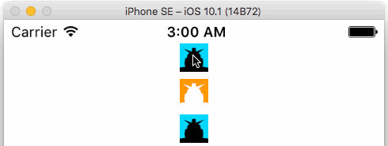

# RadioImageSample

Xamarin.Forms で、ラジオボタンのように Image の画像を On / Off するサンプルです。

this is the answer of - [Xamarin.Formsで複数のImageを使ってラジオボタンのような機能を作りたい(56552)｜teratail](https://teratail.com/questions/56552) 
